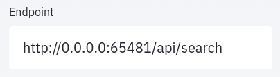
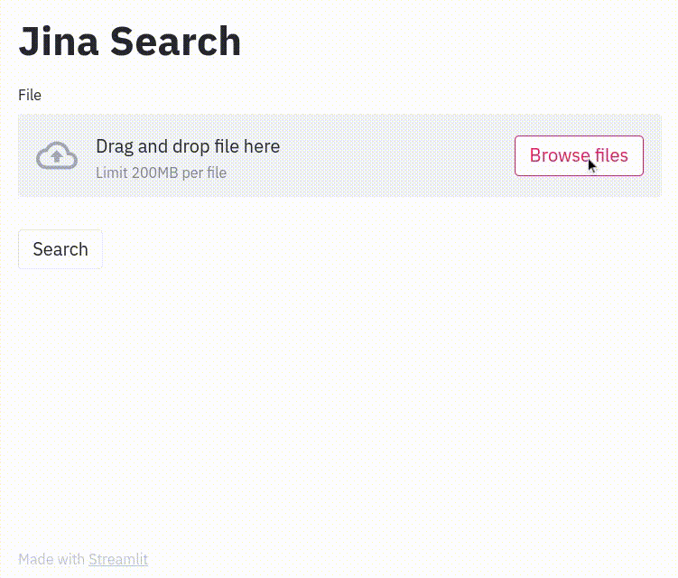

<!-- START doctoc generated TOC please keep comment here to allow auto update -->
<!-- DON'T EDIT THIS SECTION, INSTEAD RE-RUN doctoc TO UPDATE -->
**Table of Contents**

- [Jina + Streamlit](#jina--streamlit)
  - [1. Clone repo, install requirements](#1-clone-repo-install-requirements)
  - [1. Run Docker image](#1-run-docker-image)
  - [3. Start up Streamlit front end](#3-start-up-streamlit-front-end)
  - [4. Set endpoint](#4-set-endpoint)
  - [5. Search!](#5-search)

<!-- END doctoc generated TOC please keep comment here to allow auto update -->

# Jina + Streamlit Pokemon Search

A [Streamlit](http://www.streamlit.io) front-end for searching Pokemon with [Jina](http://www.jina.ai)'s neural search framework.

**Note:** You may find our [advanced Streamlit front-end](https://github.com/jina-ai/integration-streamlit-advanced/) more usable

## 1. Clone repo, install requirements

```bash
git clone git@github.com:jina-ai/integration-streamlit-pokemon.git
cd integration-streamlit-pokemon
pip install -r requirements.txt
```

## 1. Run Docker image

```bash
docker run -p 65481:65481 -e "JINA_PORT=65481" jinaai/hub.app.bitsearch-pokedex search
```

## 3. Start up Streamlit front end

```bash
streamlit run app.py
```

## 4. Set endpoint

Use whatever Docker says is the right URL and port (in example above, `65481`)



## 5. Search!



